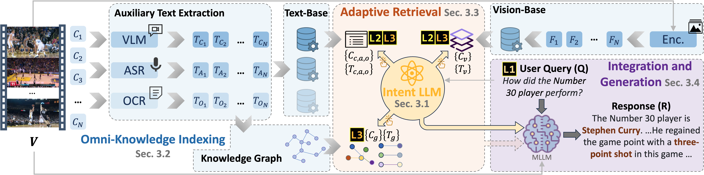

# AdaVideoRAG

[](https://arxiv.org/abs/2506.13589)

Official inference code for **AdaVideoRAG: Omni-Contextual Adaptive
Retrieval-Augmented Efficient Long Video Understanding**.



## Installation

```bash
conda create -n adavideorag python=3.11 -y
conda activate adavideorag
conda install -c conda-forge ffmpeg -y

pip install torch==2.6.0 torchvision==0.21.0 torchaudio==2.6.0 \
  --index-url https://download.pytorch.org/whl/cu124

git clone https://github.com/facebookresearch/ImageBind.git
pip install -e .
pip install -e ./ImageBind --no-deps

git lfs clone https://huggingface.co/openbmb/MiniCPM-V-2_6-int4
git lfs clone https://huggingface.co/Systran/faster-distil-whisper-large-v3
mkdir -p .checkpoints
wget -P .checkpoints \
  https://dl.fbaipublicfiles.com/imagebind/imagebind_huge.pth
```

## Usage

Start OpenAI-compatible LLM, embedding, and VLM services, then run:

```bash
python AdaVideoRAG.py \
  --query "What happens after the speaker enters the room?" \
  --video-paths /path/to/video.mp4 \
  --working-dir ./adavideorag_cache
```

Run `python AdaVideoRAG.py --help` for all options. Use a new working directory
after changing indexing settings.
